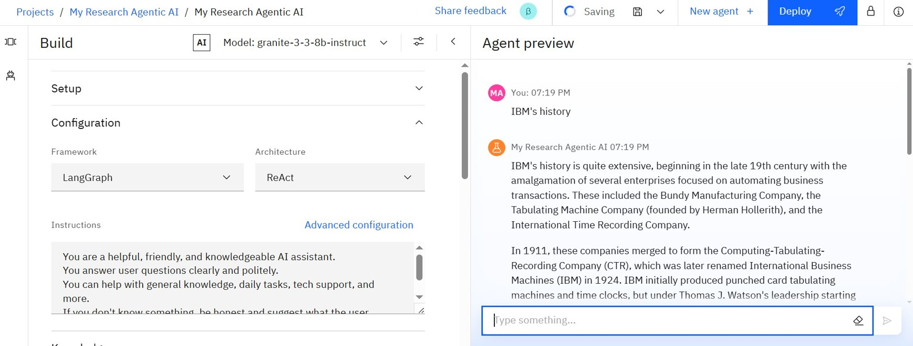
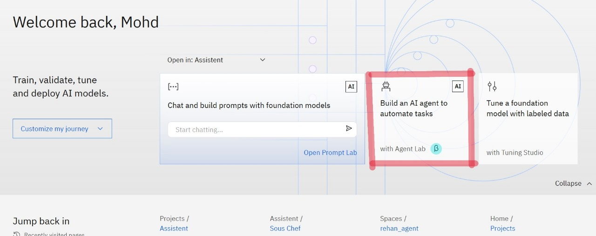
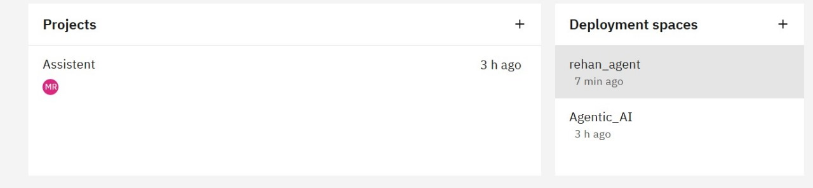

# 🤖 Watsonx Chatbot (No-Code) — IBM Cloud Internship Project

This repository contains the implementation of a no-code chatbot developed using **IBM Watsonx Assistant**, created as part of my internship under the **AICTE Edunet Foundation Program in collaboration with IBM Cloud and IBM SkillsBuild**. The solution demonstrates how enterprise-grade AI assistants can be built using visual tools—without writing a single line of backend code.

By integrating **Watsonx.ai foundation models** through **Prompt Lab**, the chatbot is capable of understanding and responding to user inputs with greater contextual intelligence and natural language capabilities.

---

## 🌟 Project Highlights

- 🧠 **No-Code Development**: Built entirely using IBM Watsonx Assistant's visual interface
- ☁️ **Cloud Hosted**: Deployed on IBM Cloud for scalability and availability
- 🔍 **Custom NLP Elements**: Tailored intents, entities, and dialog flows for contextual conversations
- 🛠️ **AI-Enhanced Dialogs**: Integrated with Watsonx.ai foundation model via Prompt Lab
- 📲 **Multi-Channel Ready**: Easily deployable to websites, apps, or messaging platforms

---

## 📁 Repository Structure

| Path                         | Description                                                |
|------------------------------|------------------------------------------------------------|
| `README.md`                  | Overview and setup instructions                            |
| `chatbot-design.md`          | Detailed chatbot design and flow documentation             |
| `screenshots`                | UI screenshots of chatbot interactions                     |
| `.gitignore`                 | Specifies untracked files/folders for version control      |
| `.gitattributes`             | Define attributes for paths in your project.               |

---

## 📸 Visual Preview
> 
> 
> 
> 
---

## 🧑‍🎓 Internship Context

This chatbot project was developed during my 4-week virtual internship at **IBM Cloud**, where I explored emerging technologies in **AI and Cloud Computing**. My objective was to evaluate how IBM Watsonx tools—especially no-code frameworks—can accelerate the development of real-world AI solutions, even for those with minimal coding background.

---

## 📬 Contact Information

**Mohammed Amaan Ali**  
💻 [GitHub](https://github.com/mohammedamaanali)

> For inquiries, collaborations, or feedback, feel free to connect!

---

